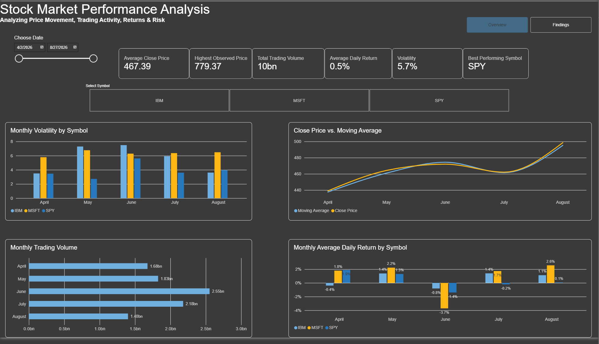
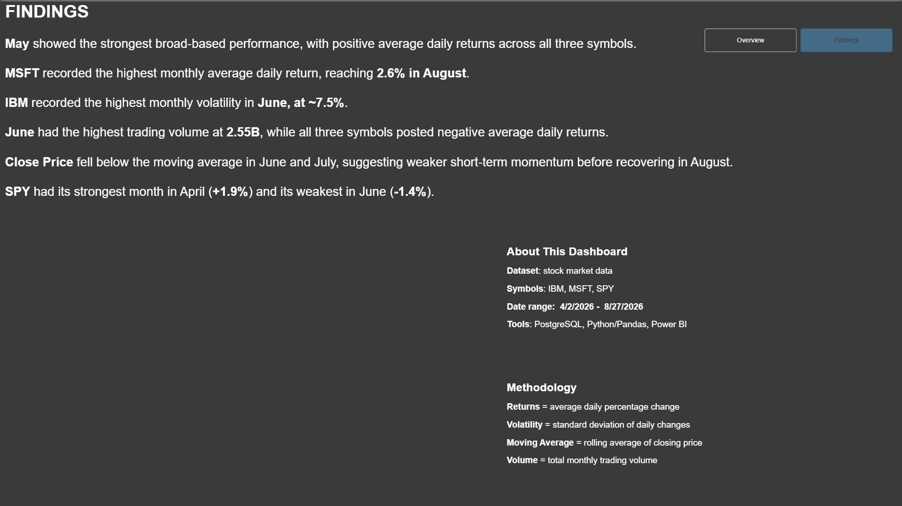

# Stock Market Performance Analysis

## Project Overview
This project analyzes IBM, MSFT, and SPY stock data using Python, PostgreSQL, SQL, and Power BI.

The project includes an automated pipeline that collects daily stock data from the Alpha Vantage API, processes it with Pandas, stores it in PostgreSQL, and visualizes the results in Power BI.

## Tools
- Python
- Pandas
- PostgreSQL
- SQLAlchemy
- Alpha Vantage API
- Power BI
- DAX

## Project Workflow
1. Extract daily stock data from Alpha Vantage
2. Clean and transform the data with Pandas
3. Calculate daily returns and 5-day moving averages
4. Load only new records into PostgreSQL
5. Analyze the data using SQL
6. Build an interactive Power BI dashboard
7. Schedule automated weekday updates

## SQL Analysis
The SQL analysis includes:
- Dataset date range
- Weekly average closing price
- 5-day rolling average
- Total return by symbol
- Best daily gain
- Percentage of days above the moving average
- Volatility analysis

## Dashboard

### Overview

### Findings

## Key Findings
- May showed positive average daily returns across all three symbols.
- MSFT recorded the highest monthly average daily return, reaching 2.6% in August.
- IBM recorded the highest monthly volatility in June, at approximately 7.5%.
- June recorded the highest trading volume at 2.55B while all three symbols posted negative average daily returns.
- Close Price fell below the moving average in June and July before recovering in August.
- SPY's strongest month was April (+1.9%) and its weakest was June (-1.4%).

## Automation
The project includes a scheduler that updates IBM, MSFT, and SPY data automatically on weekdays.

## Security
Sensitive values such as the database password and Alpha Vantage API key are stored in environment variables and excluded from version control.
